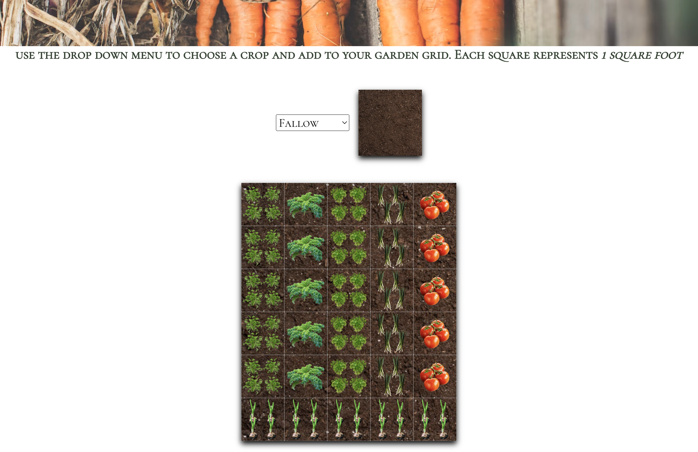

# README

TRELLIS is a web application designed for home gardeners looking to maximize their growing capabilities and yields. This app provides an easy and approachable grid system where users can plan out their dream garden.

Features
* A user can log in or sign up to access features not available to those without an account
* Users can create and edit multiple gardens using their account
* When building a garden, users are able to access information relevent to their gardens such as how many seeds they'll need, planting dates, and harvest dates
* Users can view all of their gardens on a carousel feature
* A home page with on-scroll animations
* Crops page with growing needs and information of 24 different vegetables

Utilized Technologies
* Languages
  * JavaScript
  * Ruby
  
* Frameworks
  * React 18.2.0
  * Rails 7.0.4

* Others
  * PostgresSQL
  * HTML
  * CSS
